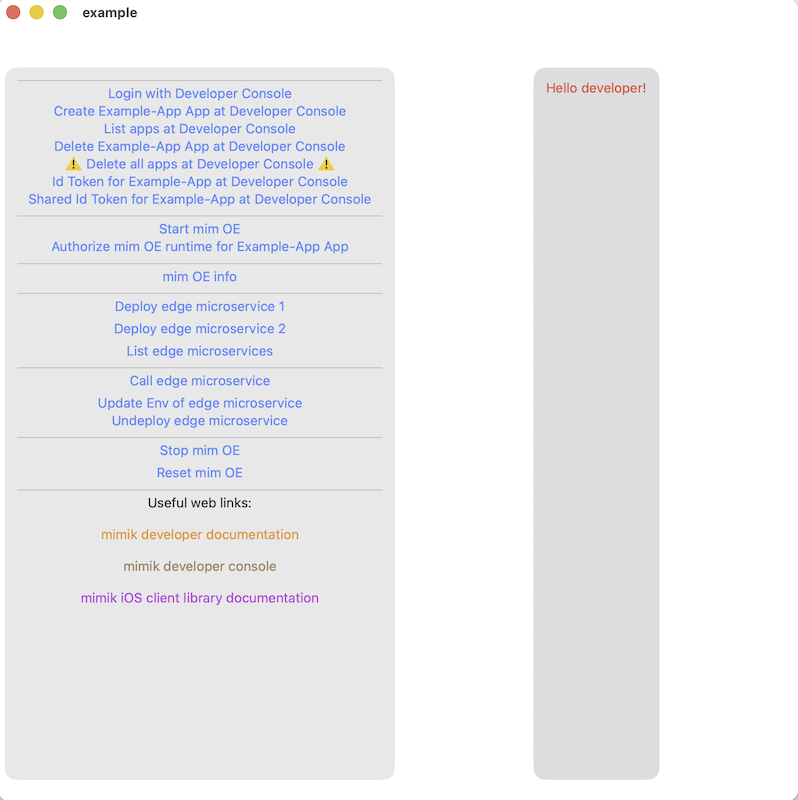

# iOS-devdocs-example-01
Example Xcode project for iOS Tutorials 01


# Technical Prerequisites

This example Xcode project has the following technical prerequisite: 

* An actual device running the latest iOS version, connected to the machine with the latest version of Xcode.

# Getting the Source Code

The example Xcode project has all the UI elements and initialization behavior needed to get the code up and running. 

The place to start is cloning the code from GitHub and loading it into Xcode.

Execute the following command to clone the example code from GitHub:

```
git clone https://github.com/mimikgit/iOS-devdocs-example-01.git
```

# Opening the Xcode Project

As mentioned in the tutorials, the mimik Client Library cocoapods `EdgeCore` and `EdgeEngineDeveloper`, need to be made available to the application source code.

We have setup these references in the `Podfile` file at the project level for you.

**Step 1**:** From the command line run the following command to get to the Xcode project directory.

```
cd iOS-devdocs-example-01
```

**Step 2**:** From the command line run the following command (from inside the Xcode project directory).

```
pod install --repo-update
```

**Step 3:** From the command line run the following command in your project directory.

```
open example.xcworkspace
```

**Step 4:**  Go to the mimik Developer Console and generate the Developer ID Token from an edge project. 

Learn more about the token generation process by reading this [article](https://devdocs.mimik.com/key-concepts/03-index)

Once generated, copy the Developer ID Token. Then in the example project code find the `let devIdToken` placeholder and replace it with the actual Developer ID Token value.


**Step 5:**  Back to the mimik Developer Console and copy the Developer edge License from there as well. 

Learn more about the process by reading this the tutorial [Getting the edgeEngine license and Identity server values from mimik Developer Portal](https://devdocs.mimik.com/tutorials/02-index)

In the example project code find the `let edgeLicense` placeholder and replace it with the actual Developer edge License value.

**Step 6:**  Connect an actual iOS device to the Xcode machine, compile the project and run it on the connected device. Explore the functions while reading through the tutorials.

|**NOTE:** <br/><br/>**This example project requires a real iOS device running the latest iOS version.**<br/><br/>Working with the iOS Simulator and the mimik Client Libraries entails some special consideration. For more more information about iOS Simulator support see [this tutorial](../tutorials/12-index#workingwithaniossimulator).|
|----------|

# Example Functions:

